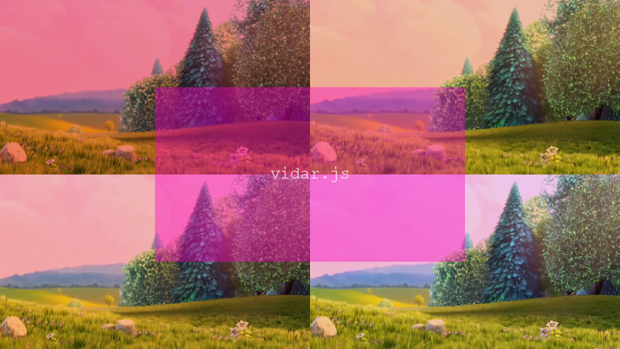

# Vidar.js
> A video editor for developers



Vidar.js is an in-browser video-editing framework. Similar to video-editing software, it lets you layer media and other content on a timeline. Audio, image, video and other tracks are supported, along with powerful video and audio manipulation to existing tracks.

Some things you can do with this framework are making a video-editor with a UI, making a machine-generated video, or just having fun mixing videos. Being very flexible and extendable, you can choose to only use the core components or define your own.

## Installation

Use [one of the bundled files](dist).

## Usage

```html
<script src="vidar-iife.js"></script>
```

or

```js
import vd from 'vidar-esm.js';
```

Then, to create a movie (which is a project)
```js
const movie = new vd.Movie(canvas);
```

Then, add layers
```js
movie
  // add an empty blue layer starting at 0s and lasting 3s and filling the entire screen
  .addLayer(new vd.layer.Base(0, 3, {background: 'blue'}))
  // add a cropped video layer starting at 2.5s
  .addLayer(new vd.layer.Video(2.5, video, {mediaX: 10, mediaY: -25}));
```

To start the movie, just like any ol' `<video>` or `<audio>`, use `.play()`
```js
movie.play();
```

## License

Distributed under GNU General Public License v3. See `LICENSE` for more information.

## Further Reading

To learn more, please see the work-in-progress [wiki](https://github.com/clabe45/vidar.js/wiki).

## Contributing

* Join the [Slack channel](https://join.slack.com/t/vidarjs/shared_invite/enQtNzgxODc0ODUyMjU2LTA5MGM5YzIyOGU5NjQxY2E0YmIzYzhhZTU4ODdjNzBiY2M3MzgwZTZiYzU5ZmE2NmYyMjc0ZTE0ZWIxMjBmN2Q) to ask questions or discuss the project casually
* Please read [the docs](docs/)

1. Fork it (https://github.com/clabe45/vidar.js/fork)
2. Create your feature branch (`git checkout -b fooBar`)
3. Commit your changes (`git commit -m ':emoji: Concise description'`, use [this](http://gitmoji.carloscuesta.me/) as an emoji reference)
4. Push to branch (`git push origin fooBar`)
5. Create a Pull Request
